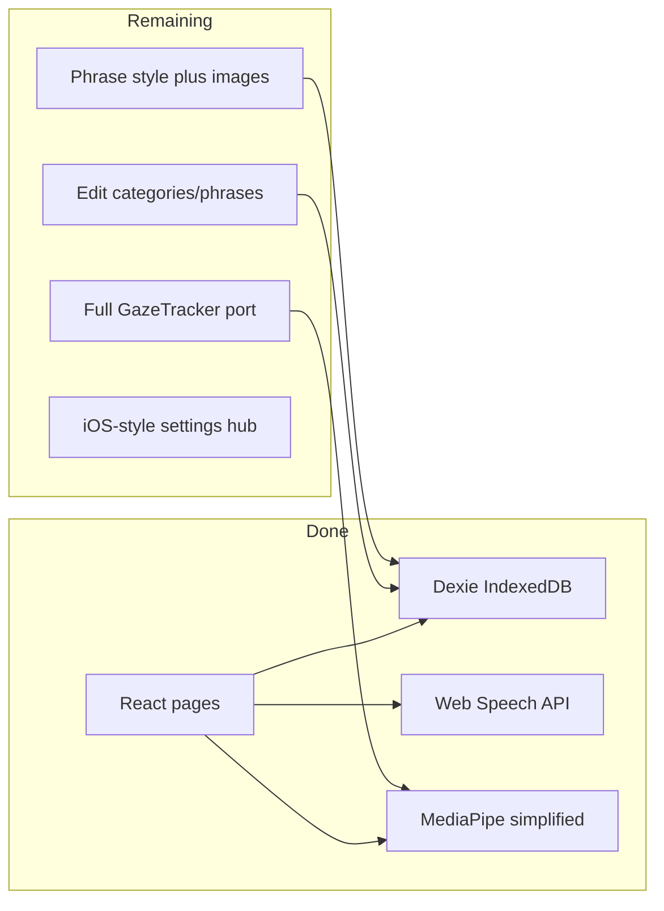

# Switch2Go Web — Remaining Build Plan

Use this plan in a **new conversation** by saying e.g. *"Implement Phase 2 of `.cursor/plans/web_remaining_work.plan.md`"*.

---

## Already shipped (do not re-build)

| Item | Location |
|------|----------|
| Vite + React + TS scaffold, GitHub Pages CI | `web/`, `.github/workflows/pages.yml` |
| Preset seed (6 categories, 20 phrases, recents) | `web/src/data/presets.json`, `seed.ts` |
| IndexedDB schema (preset + custom tables) | `web/src/data/db.ts` |
| Categories → phrases navigation, TTS, paging | `CategoriesPage.tsx`, `PhrasesPage.tsx` |
| CVI: 1–4 symbols/page, 4 position colors | `settingsStore.ts`, Settings (partial) |
| Dwell selection + gaze pointer overlay | `dwellManager.ts`, `DwellSelectable.tsx` |
| Basic MediaPipe eye gaze + head pose (no calibration) | `trackingManager.ts` |
| Keyboard switches 1–4 | `PhrasesPage.tsx` |
| Minimal settings + reset | `SettingsPage.tsx` |

**Out of scope:** 9-point gaze calibration UI or persisted calibration transforms.

---

## Architecture

**References:** iOS UI in `iosApp/iosApp/`, algorithms in `shared/src/commonMain/kotlin/com/vocable/`, presets in `PresetData.kt`.

---

## Phase 1 — Data and preset hygiene

**Goal:** Stop manual drift between mobile and web preset content.

| Task | Details | Reference |
|------|---------|-----------|
| 1.1 Preset export script | Gradle task or `scripts/export-presets.mjs` → regenerates `web/src/data/presets.json` | `PresetData.kt`, `Category.kt` |
| 1.2 npm script | `"sync-presets": "node ../scripts/export-presets.mjs"` in `web/package.json` | — |
| 1.3 Repository CRUD | insert/update/delete/reorder/hide for `category` + `phrase` tables | SQLDelight `.sq` files |
| 1.4 PhraseStyle type | TS type matching KMP JSON: backgroundColor, textColor, fontSize, bold, borderWidth, borderColor, emoji, imageRef | `PhraseStyleEditorView.swift` |

**Acceptance:** Add custom category + phrase via API; data survives refresh.

---

## Phase 2 — Edit categories and phrases

**Goal:** Match iOS Settings → “Edit Categories & Phrases”.

| Task | Details | iOS reference |
|------|---------|---------------|
| 2.1 Settings hub | Navigable hub (grid rows), not one long scroll page | `MainSettingsView.swift` |
| 2.2 Edit categories list | List preset + custom; hide/show; reorder; add custom | `EditCategoriesListView.swift` |
| 2.3 Edit category detail | Name, color, symbol for custom; preset overrides | `EditCategoryDetailView.swift`, `SymbolPickerView.swift` |
| 2.4 Edit phrases per category | List; add/edit/delete; reorder; soft-delete presets | `EditCategoryPhrasesView.swift`, `EditPhraseDetailView.swift` |
| 2.5 Phrase text mapping | `phrase_id` → label (presets); editable text for custom only | `PhrasesViewModel.swift` |
| 2.6 Empty states | No categories / no phrases | `EmptyCategoriesView`, `EmptyPhrasesView` |

**Acceptance:** Create “My Sayings”, add phrases, speak them, appear in Recents.

---

## Phase 3 — Custom keyboard

| Task | Details | iOS reference |
|------|---------|---------------|
| 3.1 QWERTY page | Type utterance, pick category, save to `phrase` table | `KeyboardView.swift` |
| 3.2 Entry points | From edit-phrases “Add” and/or settings | iOS nav |
| 3.3 Emoji picker | Store in `PhraseStyle.emoji` | `EmojiKeyboardView.swift` |

---

## Phase 4 — Phrase styling and images

| Task | Details | iOS reference |
|------|---------|---------------|
| 4.1 Style editor UI | Colors, font size, bold, border | `PhraseStyleEditorView.swift` |
| 4.2 Render images on tiles | Load `imageRef` blob on `PhrasesPage` | `PhrasesView.swift` |
| 4.3 Image import | Link image tool + file picker → IndexedDB | `ImagePickerView.swift` |
| 4.4 Blob storage | Dexie `images` store keyed by UUID | iOS Documents `custom_image_*.png` |

---

## Phase 5 — Settings parity (split screens)

Wire all keys from `AppSettings.swift` into `settingsStore.ts` (many exist without UI).

| Screen | Settings | iOS reference |
|--------|----------|---------------|
| 5.1 Timing & sensitivity | Dwell, sensitivity, repeat dwell + delay | `TimingSensitivityView.swift` |
| 5.2 Selection mode | Touch / eye / head | `SelectionModeView.swift` |
| 5.3 CVI display | Symbol count | `CVIDisplaySettingsView.swift` |
| 5.4 Categories display | Per-category colors/symbols on grid | `CategoriesDisplaySettingsView.swift` |
| 5.5 App border color | Full-screen background | `AppBorderColorView.swift` |
| 5.6 Advanced eye tracking | GPU, 2D/3D, smoothing, eye selection, gaze amp, banners, recenter toggles | `AdvancedEyeTrackingView.swift` |
| 5.7 Head tracking | Camera preset, yaw/pitch offset, sens X/Y | `AppSettings` head* keys |
| 5.8 Reset app | Confirm + DB + settings reset | `ResetAppView.swift` |
| 5.9 Recenter cursor | Button → tracking manager | Main settings |
| 5.10 Switch control | Info only: keyboard 1–4; no USB HID on web | `SwitchControlSettingsView.swift` (read-only) |

---

## Phase 6 — Full gaze pipeline

Replace simplified `trackingManager.ts` with ports from shared module. **No calibration.**

| Task | Details | Reference |
|------|---------|-----------|
| 6.1 Smoothing modes | none, simple, kalman, adaptive, combined | `GazeTracker.kt`, `AdaptiveKalmanFilter2D.kt` |
| 6.2 2D vs 3D iris | Toggle tracking method | `IrisGazeCalculator.kt`, `Eyeball3DGazeCalculator.kt` |
| 6.3 Eye selection | left / right / both | `GazeTracker` |
| 6.4 Recenter | Double-blink + auto-recenter | `GazeTrackingManager.swift` |
| 6.5 Web Worker | FaceLandmarker off main thread | — |
| 6.6 Model hosting | `web/public/models/face_landmarker.task` | iOS Resources |

**Acceptance:** Gaze quality close to iPad app; acceptable FPS on Safari.

---

## Phase 7 — UX polish

| Task | Reference |
|------|-----------|
| 7.1 Onboarding | `WelcomeView.swift` |
| 7.2 Troubleshooting | `TroubleshootingView.swift` |
| 7.3 Privacy policy | `PrivacyPolicyView.swift` / switch2goaac.org |
| 7.4 Localization | `en.lproj/Localizable.strings` (+ fr/es) |
| 7.5 PWA manifest | iPad Add to Home Screen |
| 7.6 iPad layout | Landscape, large tiles |
| 7.7 Category symbols | SVG/emoji map for preset categories |

---

## Phase 8 — QA and deploy

| Task | Details |
|------|---------|
| 8.1 iPad Safari matrix | Eye, head, dwell, camera deny |
| 8.2 Export/import JSON | Backup IndexedDB + settings |
| 8.3 CI on PR | `npm run build` in `web/` |
| 8.4 Pages base path | `/Switch2GO_AAC_iPadOS/` assets + router |
| 8.5 Error boundaries | MediaPipe/WASM failure fallback |

---

## Recommended order

1. Phase 1 → Phase 2 (biggest functional gap)
2. Phase 4 + Phase 3
3. Phase 5
4. Phase 6
5. Phase 7–8

---

## Copy-paste prompts for new chats

**Phase 2:**
> Implement Phase 2 of `.cursor/plans/web_remaining_work.plan.md`: settings hub + edit categories/phrases CRUD using Dexie in `web/src/data/`. Match iOS `EditCategoriesListView` and `EditCategoryPhrasesView`.

**Phase 6:**
> Implement Phase 6 of `.cursor/plans/web_remaining_work.plan.md`: port KMP `GazeTracker` to `web/src/tracking/` with Web Worker MediaPipe. No calibration UI.

---

## Files touched most often

| Area | Files |
|------|-------|
| Settings routes | `web/src/pages/settings/*`, refactor `SettingsPage.tsx` |
| CRUD | `repository.ts`, new `crud.ts` |
| Phrase UI | `PhrasesPage.tsx`, editor components |
| Tracking | `trackingManager.ts`, `gazeTracker.ts`, `worker/faceLandmarker.worker.ts` |
| Presets | `scripts/export-presets.mjs`, `presets.json` |
