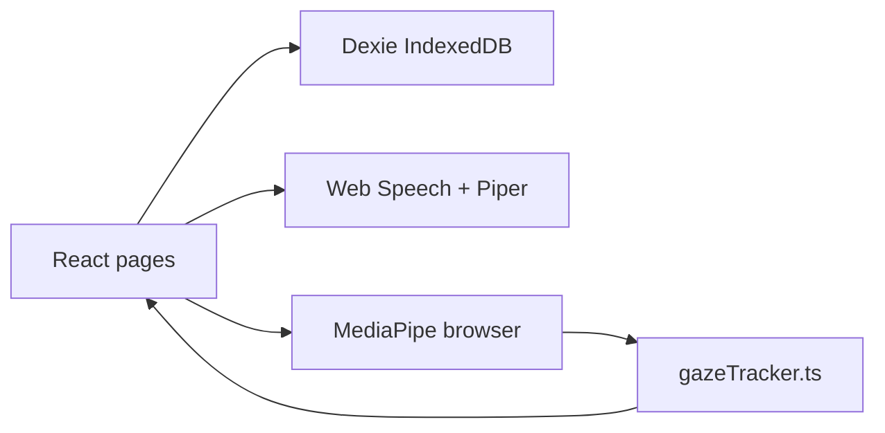

# Switch2Go Web — Build Plan (updated)

**Last reconciled:** against `web/src/App.tsx` and settings/tracking routes in the repo.

Use this plan in a new chat, e.g. *"Implement Phase 1 of `.cursor/plans/web_remaining_work.plan.md`"*.

---

## Shipped (do not re-build)

| Area | Location |
|------|----------|
| Vite + React + TS, GitHub Pages CI | `web/`, `.github/workflows/pages.yml`, `web.yml` |
| Preset seed + IndexedDB (Dexie) | `web/src/data/presets.json`, `db.ts`, `seed.ts`, `crud.ts` |
| Categories → phrases, TTS (native + Piper) | `CategoriesPage.tsx`, `PhrasesPage.tsx`, `tts/` |
| CVI 1–4 symbols, position colors | `CVIDisplayPage.tsx`, `settingsStore.ts` |
| Dwell + gaze overlay | `dwellManager.ts`, `GazeOverlay.tsx` |
| Full gaze pipeline (no calibration UI) | `gazeTracker.ts`, `TrackingContext.tsx` |
| Head pose + arm raise + hand gesture | `headPoseTracker.ts`, `armRaise*`, `gestureRecognizer*` |
| MediaPipe models (face, pose, gesture) | `public/models/*.task`, CI in `web.yml` |
| Settings hub + split screens | `SettingsHubPage.tsx`, `web/src/pages/settings/*` |
| Edit categories/phrases + phrase style | `Edit*Page.tsx`, `PhraseStyleEditorPage.tsx` |
| Selection modes (touch, eye, head, arm, hand) | `SelectionModePage.tsx` |
| Switch info (keyboard 1–4) | `SwitchControlPage.tsx` |
| Backup / restore JSON | `DataBackupPage.tsx` |
| Onboarding, troubleshooting, privacy, licenses, i18n | `OnboardingOverlay.tsx`, etc. |
| PWA manifest | `index.html`, `manifest.webmanifest` |
| Games on phrases | `GameOverlay.tsx`, `web/src/game/` |
| Media / YouTube on phrases | `media/`, `YouTubePickerModal.tsx` |

**Out of scope (by design):** 9-point gaze calibration UI or persisted calibration transforms (same as iOS main flow).

---

## Remaining work

### Phase 1 — Preset sync (pending)

| Task | Details |
|------|---------|
| Export script | `scripts/export-presets.mjs` (or Gradle task) → `web/src/data/presets.json` from `PresetData.kt` |
| npm script | `"sync-presets": "node ../scripts/export-presets.mjs"` in `web/package.json` |

**Acceptance:** Running sync updates web presets without hand-editing JSON.

### Phase 3 — QWERTY keyboard (pending)

| Task | Details | iOS reference |
|------|---------|---------------|
| QWERTY page | Type utterance, pick category, save phrase | `KeyboardView.swift` |
| Entry points | From edit-phrases / settings | iOS navigation |
| Emoji row | Optional; style editor already supports emoji | `EmojiKeyboardView.swift` |

**Current gap:** `AddPhrasePage.tsx` uses a textarea only.

### Optional polish (not phased)

| Item | Notes |
|------|-------|
| Web Worker for FaceLandmarker | Main thread works; worker would help Safari FPS |
| Scan & Select switch mode | iOS has full scan; web documents keyboard 1–4 only |
| Deeper iPad landscape layout | Usable today; tune tile sizes if needed |
| Category symbol SVG map | Presets use emoji/text; parity with iOS symbols |

---

## Architecture (current)

**References:** iOS UI `iosApp/iosApp/`, algorithms `shared/src/commonMain/kotlin/com/vocable/`.

---

## Copy-paste prompts

**Phase 1:**
> Implement Phase 1 of `.cursor/plans/web_remaining_work.plan.md`: add `scripts/export-presets.mjs` and wire `npm run sync-presets` from KMP `PresetData.kt`.

**Phase 3:**
> Implement Phase 3 of `.cursor/plans/web_remaining_work.plan.md`: QWERTY keyboard page for custom phrases, matching iOS `KeyboardView.swift`.

---

## Files (remaining phases)

| Phase | Likely files |
|-------|----------------|
| 1 | `scripts/export-presets.mjs`, `web/src/data/presets.json`, `web/package.json` |
| 3 | `web/src/pages/settings/KeyboardPage.tsx` (new), `App.tsx` routes |
